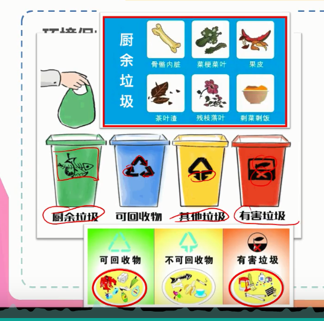

## 生活常识

### 自救逃生

1. 火灾逃生

```
1. 收到火势威胁时，要当机立断披上侵湿的衣物、被褥等向安全出口方向冲出去，要迅速逃生，不要贪恋财务

2. 不要盲目跳楼，可利用疏散楼梯、阳台、落水管等逃生自救；页而已用绳子把床单，被套撕成条状，
连城绳索，金栓在窗框、暖气管、铁杆栏等固定物上，用毛巾，布条保护手心，顺绳子华夏，或下到我找回楼
的楼层脱离险境

3. 穿过浓烟逃生时，要尽量使身体贴近地面，并用湿毛巾捂住口鼻

4. 室外着火，门已发烫，千万不要开门，以防大货窜入室内，要用湿的被褥、衣服等堵塞们窗缝，
，并泼水，降温

5. 若所在逃生路线被大火封闭，呀立即退出室内，用打手电筒、挥舞衣物、呼叫等方式向窗外发送求救，
信号，等待救援。不可乘坐电梯，要向安全出口方向逃生。

```

2. 燃气泄漏

```
1. 迅速关闭阀门，打开窗户通风
2. 不要使用明火，不要有金属摩擦，不要开关灯或电器

3. 把抹布打湿铺在着火位子，等火彻底熄灭后，关闭阀门。

4. 若有人员中毒，应立刻 将中毒人员搬离现场，放在通风的地方。


```

3. 灭火器

```
1. 干粉灭火器

将铵盐干粉喷射在可燃物表面，形成一层覆盖层，从而磷酸隔绝氧气灭火

2. 泡沫灭火器

需要上下颠倒使用，主要是溶液发生反应产生二氧化碳和泡沫，
快速隔绝氧气从而灭火，因由溶液导电，电类火灾不能用泡沫灭火器

3. 二氧化碳灭火

将液态二氧化碳压缩在小钢瓶中，使用时不能直接接触金属瓶身，防止冻伤。

4. 清水灭火器


```
4. 雷雨天须知

```
1. 遇到突然的雷雨，可以蹲下，降低自己的高度，同时将双脚并拢，以减少跨步电压带来 危害
2. 不要在大树底下避雨，不要在水边、洼地及山顶、楼顶上停留；不要拿着金属物品及解接打手机；
不要触摸或者靠近防雷接地线，自来水管、家用电器的接地线。


- 雷雨天 不能再低洼处，会被淹死
- 雷电天  可以在低洼处
```

5. 洪水逃生须知

```
听从政府安排尽快转移，来不及转移，也不必要惊慌，
可以向高处（结实的楼房顶，大树上）转移，等候救援人员营救，
为防止洪水涌入屋内，首先要堵住大门下面所有空隙。如果洪水不断上涨。应该在楼上
储备一些事物、饮用水、保暖衣服。如果水灾严重，水位不断上涨，就必须要自制木筏逃生，
在爬上木筏之前，一定要试试木筏能否漂浮稳定，视频，发信号用具、发奖等是必不可少的。

```
6. 身体应急处理

```
1. 中暑
脱离环境: 让患者脱离高温环境，迅速将患者转移至阴凉通风处休息
冷敷： 应在头部，颈部、腋窝等大动脉血管部位放置冰袋、并可用冷水或者30%的酒精擦浴知道皮肤发红
补液：如果患者神志清醒，并无恶心、呕吐、可饮用含盐的清凉饮料、茶水、绿豆汤等、以起到及降温又补充血容量的作用

2. 冻伤烫伤
不能用过热过冷的水，必须用温水

3. 运动扭伤(氯乙烷-麻醉剂，冷冻剂)

应先冷敷患处、24小时候改用热敷、用绷带缠住足踝，把脚垫高， 既可减轻症状。

4. 毒蛇咬伤

不要惊慌奔走，要保持镇静，以免加速毒物的吸收和扩散

立刻对伤口进行局部处理，立即在伤口近心端2~3厘米处用绳子结扎，每15分钟左右放松1分钟
，防止肢体缺血坏死。

尽快到医院急诊室进行处理

特效解毒抗毒血清注射应用越早越好


```

### 健康系列

1. 食品制作

```
烹饪: 炒，炸，烹（peng；先炒，再加入液体），煎、焖，煨（瓦罐小伙慢慢煮），焗（蒸汽），
烩（现炒，勾芡，大杂烩），烤，熏，汆(高温煮沸的水，放入就取出)，炖，熬，煮，蒸

```
2. 发酵工艺（饼干不发酵）：常见的发酵产品有白酒
```
醋、馒头、腐乳、泡菜等

```
3. 食品添加剂（甲醛：福尔马林不能作为添加剂，泡尸体才用）

```
1. 防腐剂- 防止食品腐烂、变质、如苯甲酸钠、硝酸盐、茶多酚、二氧化硫、山梨酸钾

2. 找色剂(苏丹红有毒不能做)-- 改善食品外观、如胡萝卜素、胭脂红、柠檬黄

3. 营养强化剂-- 增强食品的营养价值、如食盐中加碘、酱油中加铁
4. 微量元素

碘、铁（血红蛋白，缺少会镰刀型贫血）、锌（小孩子发育）
```

### 医学常识

1. 处方药和非处方药

```
1. （阿莫西林）处方药是指经过医生处方才能从药房或药店获取并要在医生监控下或
指引下使用的药物，简称RX
2. 非处方药是指不要医生处方，消费者可直接从药房或者药店购取的药物，简称OTC
```
2. 服药注意事项

```
服药要用温开水
干吞药物有危险
服药时间需注意
忘吃药不能加倍吃回来
服用抗生素应忌酒

```

### 健康
1. 酒
```
可取的醒酒方式: 梨，香蕉，草莓、萝卜。
不可取的醒酒方式： 喝浓茶、喝醋、喝汽水

```
2. 吸烟

```
香烟点燃时所释放的化学物质主要是焦油和一氧化碳等化学物质，
香烟点燃后产生对人体有害的物质大致分为六大类：考试精彩考察2、4/5、、6四类

1. 荃类、氮化物、烯烃类，对呼吸道有刺激作用
2. 尼古丁类，可刺激交感神经，让吸烟者形成依赖
3. 胺类、氰化物和重金属，均属毒性物质。
4. 苯丙比，砷、镉、甲基井、氨基酚、其他放射性物质，均有致癌作用。
5. 酚类化合物和甲醛等，具有加速癌变的作用
6. 一氧化碳，降低红细胞将氧输送到全身的能力。

```
3. 鱼刺卡喉

```
1. 鱼刺卡喉，喝醋解决不了问题
2. 如果刺不大，扎的不深， 就可用长镊子夹出来
3. 如若较深， 要求医

```
### 环境保护

1. 垃圾分类
```
有害垃圾: 废电池、荧光灯管、油漆桶、过期的药品

易腐垃圾： 除可回收物、废玻璃、有害垃圾以外的各种生活废弃物

可回收垃圾： 包括报纸等（报纸、杂志）、塑料（袋盒）、金属（瓶罐）、布类（衣，被等）

```
2. 回收
```

厨余：绿色
可回收： 蓝色
其他垃圾: 黄色

有害垃圾: 红色
```


3. 垃圾处理方式（循环可利用是最好的处理方式）
- 垃圾处理要遵循无害化、减量化、资源化的原则，目前常用的方法有卫生填埋、堆肥和焚烧三种
处理方式

```
1. 垃圾填埋： 是我国主要的处理方式，占到总量90%以上，这种处理方式
不仅占用土地，而且损伤地表，污染底下水和土壤
2. 堆肥法（不是最好的处理方法）： 是利用自然界的微生物对垃圾记性有机分解之后使之形成肥料，作为农作物的营养
达到处理进化的目的
3. 焚烧法： 是在高温下将垃圾燃烧成渣，再运到填埋场进行填埋的一种方式

```
4. 大气环境保护（冰箱和空调制冷原理一样）

```
1. 酸雨: PH小于5.6的降水，主要是人为排放硫氧化物和氮氧化物等造成的，我国以硫酸雨为主

2. 臭氧层受损：20世界80年代在南测到臭氧空洞，人类活动排出的氟卤代烷和
含溴的卤代烷烃（氟利昂）是主要原因。
3. 温室效应： 二氧化碳（甲烷等）等温室气体排入大气，使得大气平均温度上升，进而导致全球气候变暖

4. pm2.5:细颗粒物又称细粒、pm2.5.细颗粒物指环境空气中空气动力学当量直径小胡2.5
微米的颗粒物。它能较长时间炫富于空气中，其在空气中含量浓度越高，就代表
空气污染越严重
5. pm10： 可吸入粒物，通常是指粒径在10微米以下的颗粒物又称pm10.可吸入颗粒物
在环境空气中持续时间很长，对人体健康和大气能见度的影响都很大
```
5. 水资源保护
- 水是一种非常宝贵的资源，但是随着工农业生产的家居和人口的膨胀，人资源在日益减少
的同时，因为工农业生产排放的污水量增加进而导致水污染。
```
1. 重金属污染（选矿、铜、铅）
2. 水体富营养化（水华、赤潮（海洋））（p磷）

```

6. 土壤污染处理（很难解决）
```
当土壤中含有害物质过多，超过土壤的自净能力，有害物质或者其分解物在
土壤中逐渐积累通过 土壤-> 植物-> 人体，或通过 土壤->水->人体间接被人体吸收。
达到危害人体健康的程度，就是土壤污染

```